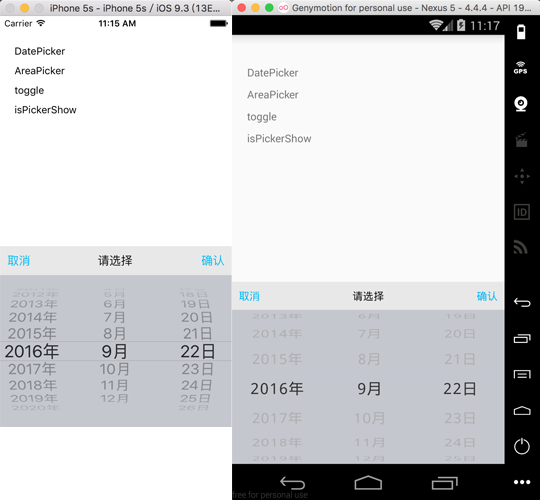

# react-native-picker

[](https://www.npmjs.com/package/react-native-picker) <a href="https://david-dm.org/beefe/react-native-picker"></a>   

### For pure javascript version -> [v3.0.5](https://github.com/beefe/react-native-picker/tree/pure-javascript-version)



###Documentation

####Params

|Key | Description | Type | Default|
| --- | ----------- | ---- | ------ |
|pickerConfirmBtnText  |            |string  |confirm            |
|pickerCancelBtnText   |            |string  |cancel             |
|pickerTitleText       |            |string  |pls select         |
|pickerConfirmBtnColor |            |array   |[1, 186, 245, 1]   |
|pickerCancelBtnColor  |            |array   |[1, 186, 245, 1]   |
|pickerTitleColor      |            |array   |[20, 20, 20, 1])   |
|pickerToolBarBg       |            |array   |[232, 232, 232, 1] |
|pickerBg              |            |array   |[196, 199, 206, 1] |
|pickerToolBarFontSize |            |number  |16                 |
|pickerFontSize        |            |number  |16                 |
|pickerFontColor       |            |array   |[31, 31, 31, 1]    |
|pickerData            |            |array   |                   |
|selectedValue         |            |string  |                   |
|onPickerConfirm       |            |function|                   |
|onPickerCancel        |            |function|                   |
|onPickerSelect        |            |function|                   |

####Methods

|Name | Description | Type | Default|
| --- | ----------- | ---- | ------ |
|init         |init and pass parameters to picker      |     |   |
|toggle       |show or hide picker                     |     |   |
|show         |show picker                             |     |   |
|hide         |hide picker                             |     |   |
|select       |select a row                            |array|   |
|isPickerShow |get status of picker, return a boolean  |     |   |


###Usage

####Step 1 - install

```
	npm install react-native-picker --save
```

####Step 2 - link

```
	react-native link
```

####Step 3 - import and use in project

```javascript
	import Picker from 'react-native-picker';

	let data = [];
    for(var i=0;i<100;i++){
        data.push(i);
    }

    Picker.init({
        pickerData: data,
        selectedValue: [59],
        onPickerConfirm: data => {
            console.log(data);
        },
        onPickerCancel: data => {
            console.log(data);
        },
        onPickerSelect: data => {
            console.log(data);
        }
    });
    Picker.show();
	
```

###Notice

####support two modes:

<b>1. parallel:</b> such as time picker, wheels have no connection with each other

<b>2. cascade:</b> such as date picker, address picker .etc, when front wheel changed, the behind wheels will all be reset

####parallel:

- single wheel:

```javascript
	pickerData = [1,2,3,4];
	selectedValue = 3;
```

- two or more wheel:

```javascript
	pickerData = [
		[1,2,3,4],
		[5,6,7,8],
		...
	];
	selectedValue = [1, 5];
```

####cascade:

- two wheel

```javascript
    pickerData = [
        {
            a: [1, 2, 3, 4]
        },
        {
            b: [5, 6, 7, 8]
        },
        ...
    ];
    selectedValue = ['a', 2];
```

- three wheel

```javascript
    pickerData = [
        {
            a: [
                {
                    a1: [1, 2, 3, 4]
                },
                {
                    a2: [5, 6, 7, 8]
                },
                {
                    a3: [9, 10, 11, 12]
                }
            ]
        },
        {
            b: [
                {
                    b1: [11, 22, 33, 44]
                },
                {
                    b2: [55, 66, 77, 88]
                },
                {
                    b3: [99, 1010, 1111, 1212]
                }
            ]
        },
        {
            c: [
                {
                    c1: ['a', 'b', 'c']
                },
                {
                    c2: ['aa', 'bb', 'cc']
                },
                {
                    c3: ['aaa', 'bbb', 'ccc']
                }
            ]
        },
        ...
    ]
```