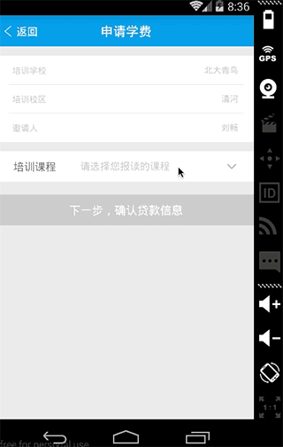

# react-native-picker


A Picker written in pure javascript for cross-platform support.

It was most likely an example of how to build a cross-platform Picker Component use [react-native-picker-android](https://github.com/beefe/react-native-picker-android).

###Warn
if 0.14.2 <= react-native <=0.24 `npm install react-native-picker@2.0.5 --save`  
if 0.24 < react-native `npm install react-native-picker --save`

####Demo

- <b>[Date-picker](./demo/date-picker.js)</b>
- <b>[Area-picker](./demo/area-picker.js)</b>





###Documentation

####Props
- <b>style</b> style of picker, you can set width and height of picker in this prop
- <b>pickerElevation</b> elevation of picker (for issue https://github.com/beefe/react-native-picker/issues/27)
- <b>pickerBtnText</b> string, tool bar's confirm btn text
- <b>pickerCancelBtnText</b> string, tool bar's cancel ben text
- <b>pickerBtnStyle</b> textStylePropType, tool bar's btn style
- <b>pickerToolBarStyle</b> viewStylePropType, tool bar's style
- <b>showDuration</b> number, animation of picker
- <b>showMask</b> boolean, default to be false, cancel the picker by tapping in the rest of the screen support when setted to be true
- <b>pickerTitle</b> string, title of picker
- <b>pickerTitleStyle</b> textStylePropType, style of title
- <b>pickerData</b> array
- <b>selectedValue</b> any
- <b>onPickerDone</b> function
- <b>onPickerCancel</b> function
- <b>onValueChange</b> function

####Methods
- <b>toggle</b> show or hide picker, default to be hiden
- <b>show</b> show picker
- <b>hide</b> hide picker
- <b>isPickerShow</b> get status of picker, return a boolean

###Usage

####Step 1 - install

```
	npm install react-native-picker --save
```

####Step 2 - import and use in project

```javascript
	import Picker from 'react-native-picker'
	
	<Picker
		style={{
			height: 300
		}}
		showDuration={300}
		showMask={true}
		pickerData={}//picker`s value List
		selectedValue={}//default to be selected value
		onPickerDone={}//when confirm your choice
	/>
```

###Notice

####support two modes:

<b>1. parallel:</b> such as time picker, wheels have no connection with each other

<b>2. cascade:</b> such as date picker, address picker .etc, when front wheel changed, the behind wheels will all be reset

####parallel:

- single wheel:

```javascript
	pickerData = [1,2,3,4];
	selectedValue = 3;
```

- two or more wheel:

```javascript
	pickerData = [
		[1,2,3,4],
		[5,6,7,8],
		...
	];
	selectedValue = [1, 5];
```

####cascade:

- two wheel

```javascript
	pickerData = {
		{
			a: [1,2,3,4],
			b: [5,6,7,8],
			...
		}
	};
	selectedValue = ['a', 2];
```

- three wheel

```javascript
	pickerData = {
		a: {
			a1: [1,2,3,4],
			a2: [5,6,7,8],
			a3: [9,10,11,12]
		},
		b: {
			b1: [1,2,3,4],
			b2: [5,6,7,8],
			b3: [9,10,12,12]
		}
		...
	};
	selectedValue = ['a', 'a1', 1];
```
